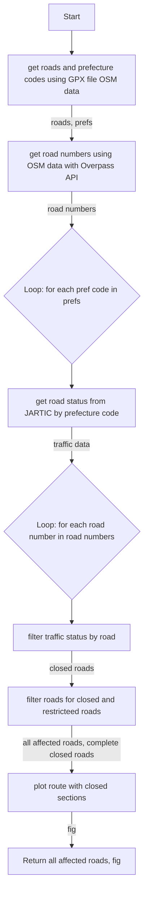

# Japan Road Traffic Analysis

## GPX Route Analysis and Road Status Visualization
This pipeline processes GPX route data to identify restricted or closed road sections and visually represents these sections on a map. It involves extracting road and prefecture information from the GPX file, retrieving road numbers and traffic status data, filtering for restricted roads, and finally plotting the route with any closed sections highlighted. This tool is useful for visualizing the accessibility of routes and planning alternate paths in case of road closures.

### Process Flow of gpx route analysis  and road status visualization

